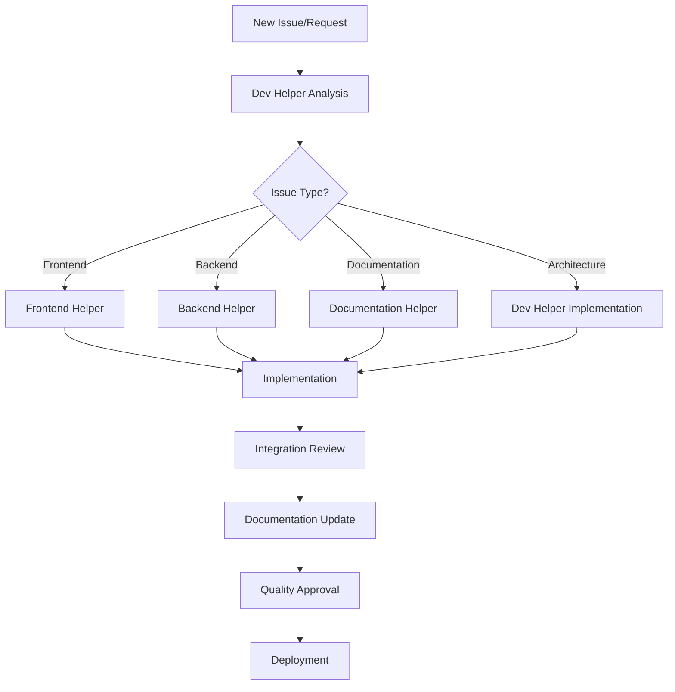

# 🤖 Copilot Chat Profiles - Agent System

## 📋 Overview

Este diretório contém os perfis especializados de Copilot Chat para organizar e otimizar o
desenvolvimento no monorepo. Cada perfil é especializado em uma área específica do projeto.

## 🎯 Agentes Disponíveis

### 1. 🎨 Frontend Helper (`frontend-helper.md`)

**Expertise**: Next.js, React, TypeScript, Tailwind CSS **Scope**: `apps/web/**`
**Responsibilities**:

- UI/UX development
- Component creation
- Frontend testing
- Performance optimization

### 2. ⚙️ Backend Helper (`backend-helper.md`)

**Expertise**: NestJS, TypeScript, APIs, Database **Scope**: `apps/api/**` **Responsibilities**:

- API development
- Database modeling
- Authentication/authorization
- Backend testing

### 3. 📚 Documentation Helper (`documentation-helper.md`)

**Expertise**: Technical writing, API docs, Architecture **Scope**: `**` (all files)
**Responsibilities**:

- API documentation
- README creation
- Architecture diagrams
- Code documentation

### 4. 🎯 Dev Helper (`dev-helper.md`)

**Expertise**: Architecture, Coordination, DevOps **Scope**: `**` (coordinator)
**Responsibilities**:

- Issue evaluation and assignment
- Architecture decisions
- Cross-helper coordination
- Quality assurance

## 🔄 Workflow de Colaboração



## 🎯 Como Usar os Perfis

### 📋 Para Issues/Features

1. **Análise Inicial**: Use `dev-helper` para avaliar e distribuir
2. **Implementação**: Use o helper especializado apropriado
3. **Documentação**: Use `documentation-helper` para documentar
4. **Integração**: Volte ao `dev-helper` para coordenação final

### 💻 Para Desenvolvimento

1. **Frontend Work**: Use `frontend-helper` diretamente
2. **Backend Work**: Use `backend-helper` diretamente
3. **Documentation**: Use `documentation-helper` diretamente
4. **Architecture/Coordination**: Use `dev-helper`

### 🔄 Para Code Review

1. **Component Review**: `frontend-helper` ou `backend-helper`
2. **Documentation Review**: `documentation-helper`
3. **Architecture Review**: `dev-helper`
4. **Integration Review**: `dev-helper` (coordenação)

## 📊 Especialização Matrix

| Task Type         | Primary Helper                 | Secondary            | Coordinator |
| ----------------- | ------------------------------ | -------------------- | ----------- |
| React Components  | frontend-helper                | documentation-helper | dev-helper  |
| API Endpoints     | backend-helper                 | documentation-helper | dev-helper  |
| Database Schema   | backend-helper                 | -                    | dev-helper  |
| UI/UX Design      | frontend-helper                | -                    | dev-helper  |
| API Documentation | documentation-helper           | backend-helper       | dev-helper  |
| Architecture      | dev-helper                     | documentation-helper | -           |
| CI/CD Pipeline    | dev-helper                     | -                    | -           |
| Performance       | frontend-helper/backend-helper | -                    | dev-helper  |
| Security          | backend-helper                 | -                    | dev-helper  |
| Testing Strategy  | frontend-helper/backend-helper | documentation-helper | dev-helper  |

## 🎯 Best Practices

### ✅ Do's

- **Sempre comece** com `dev-helper` para issues complexas
- **Use o helper específico** para tarefas focadas
- **Documente** com `documentation-helper` após implementação
- **Coordene integrações** via `dev-helper`

### ❌ Don'ts

- **Não pule** a fase de análise com `dev-helper`
- **Não misture** responsabilidades entre helpers
- **Não ignore** documentação após implementação
- **Não faça** mudanças arquiteturais sem `dev-helper`

## 🔧 Configuration

### Copilot Chat Settings

Para usar os perfis, certifique-se de que:

1. **File Scope**: Cada perfil é aplicado aos arquivos corretos via `applyTo`
2. **Context Awareness**: Helpers entendem suas limitações e responsabilidades
3. **Collaboration Patterns**: Helpers sabem quando escalar para outros

### VS Code Integration

```json
{
  "github.copilot.chat.profiles": {
    "frontend-helper": ".github/copilot-profiles/frontend-helper.md",
    "backend-helper": ".github/copilot-profiles/backend-helper.md",
    "documentation-helper": ".github/copilot-profiles/documentation-helper.md",
    "dev-helper": ".github/copilot-profiles/dev-helper.md"
  }
}
```

## 📈 Success Metrics

### 🎯 Efficiency Metrics

- **Task Assignment Speed**: How quickly issues are properly assigned
- **Cross-Helper Communication**: Frequency of successful handoffs
- **Quality Gates**: Percentage of tasks meeting quality standards
- **Documentation Coverage**: Percentage of features properly documented

### 📊 Quality Metrics

- **Code Quality**: ESLint/TypeScript compliance across helpers
- **Test Coverage**: Coverage maintained by each helper
- **Documentation Quality**: Completeness and accuracy of docs
- **Architecture Consistency**: Adherence to established patterns

## 🚀 Future Enhancements

### 🔮 Planned Improvements

- **Auto-assignment**: Automated issue routing based on labels
- **Performance Tracking**: Metrics dashboard for helper effectiveness
- **Learning Loops**: Feedback mechanisms for profile improvement
- **Integration Testing**: Cross-helper collaboration testing

### 🎯 Advanced Features

- **Custom Workflows**: Helper-specific development flows
- **Quality Automation**: Automated quality checks per helper
- **Knowledge Base**: Shared knowledge repository for helpers
- **Mentorship System**: Senior helper guidance for complex tasks

---

**Goal**: Organized, efficient, and high-quality development through specialized AI assistance! 🤖✨
