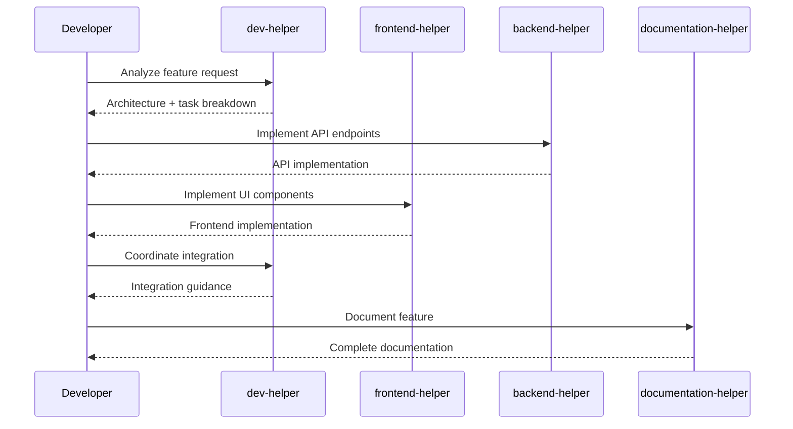

# 🤖 Guia de Uso dos Copilot Chat Profiles

## 🎯 Overview

Os perfis de Copilot Chat organizam a IA em especialistas focados, melhorando a qualidade e
eficiência do desenvolvimento.

## 🚀 Como Usar

### 1. 📋 Para Issues Complexas

```bash
# 1. Comece sempre com dev-helper
@dev-helper "Analise esta issue e distribua as tarefas: [link da issue]"

# 2. O dev-helper irá:
# - Avaliar complexidade e impacto
# - Definir arquitetura se necessário
# - Distribuir tarefas para helpers específicos
# - Coordenar a implementação
```

### 2. 🎨 Para Desenvolvimento Frontend

```bash
# Use frontend-helper diretamente para:
@frontend-helper "Crie um componente Button com variants primary, secondary e ghost"
@frontend-helper "Implemente a página de login com validação de formulário"
@frontend-helper "Adicione testes E2E para o fluxo de checkout"
```

### 3. ⚙️ Para Desenvolvimento Backend

```bash
# Use backend-helper diretamente para:
@backend-helper "Crie endpoint POST /users com validação e autenticação"
@backend-helper "Implemente middleware de rate limiting"
@backend-helper "Adicione testes unitários para UserService"
```

### 4. 📚 Para Documentação

```bash
# Use documentation-helper para:
@documentation-helper "Documente a API de autenticação com exemplos"
@documentation-helper "Crie README para o package UI"
@documentation-helper "Atualize arquitetura com novos endpoints"
```

## 🔄 Workflows Recomendados

### 📈 Feature Development



### 🐛 Bug Fix Workflow

```mermaid
flowchart TD
    A[Bug Report] --> B{Which Layer?}
    B -->|Frontend| C[@frontend-helper]
    B -->|Backend| D[@backend-helper]
    B -->|Integration| E[@dev-helper]

    C --> F[Fix + Tests]
    D --> F
    E --> F

    F --> G[@documentation-helper]
    G --> H[Update Docs]
    H --> I[Complete]
```

## 💡 Dicas de Uso

### ✅ Boas Práticas

1. **Contexto Específico**: Sempre forneça contexto específico do domínio

   ```bash
   # ✅ Bom
   @frontend-helper "No componente ProductCard, adicione um badge de desconto que mostra quando product.discount > 0"

   # ❌ Ruim
   @frontend-helper "Adicione um badge"
   ```

2. **Arquivos Relevantes**: Mencione arquivos específicos quando relevante

   ```bash
   @backend-helper "No UserController.ts, adicione validação de email único no método create()"
   ```

3. **Padrões do Projeto**: Referencie padrões estabelecidos
   ```bash
   @frontend-helper "Crie hook useAuth seguindo o padrão dos outros hooks em /hooks"
   ```

### 🎯 Quando Usar Cada Perfil

#### 🎨 Use `frontend-helper` para:

- Componentes React
- Páginas Next.js
- Styling com Tailwind
- Hooks customizados
- Testes frontend
- Otimização de performance frontend

#### ⚙️ Use `backend-helper` para:

- Controllers e Services NestJS
- Modelos de banco de dados
- Middleware e Guards
- Validação de dados
- Testes backend
- Otimização de queries

#### 📚 Use `documentation-helper` para:

- Documentação de API
- READMEs de packages
- Diagramas de arquitetura
- Guias de contribuição
- Changelog updates
- Comentários em código

#### 🎯 Use `dev-helper` para:

- Avaliação de issues
- Decisões arquiteturais
- Coordenação entre helpers
- Configurações de CI/CD
- Otimização de build
- Resolução de conflitos

## 🔧 Comandos Úteis

### 📋 Templates de Prompts

#### Para Análise de Issue:

```bash
@dev-helper "
Issue: #123
Título: Implementar sistema de notificações
Descrição: [cole a descrição]

Por favor:
1. Analise a complexidade
2. Defina arquitetura necessária
3. Distribua tarefas por helper
4. Estime esforço
"
```

#### Para Implementação Frontend:

```bash
@frontend-helper "
Tarefa: Criar componente NotificationBell
Requisitos:
- Mostra contador de notificações não lidas
- Dropdown com lista de notificações
- Marca como lida ao clicar
- Responsive design
- Testes unitários

Contexto: apps/web/components/
"
```

#### Para Implementação Backend:

```bash
@backend-helper "
Tarefa: API de notificações
Endpoints necessários:
- GET /notifications (listar)
- PATCH /notifications/:id/read (marcar como lida)
- POST /notifications (criar - admin only)

Requisitos:
- Validação com DTOs
- Autenticação obrigatória
- Paginação na listagem
- Testes E2E

Contexto: apps/api/src/notifications/
"
```

#### Para Documentação:

```bash
@documentation-helper "
Documenta o sistema de notificações:
- API endpoints com exemplos
- Componentes frontend
- Fluxo de integração
- Casos de uso

Base: implementação em /apps/api/notifications e /apps/web/components/notifications
"
```

## 🎯 Troubleshooting

### ❓ Problemas Comuns

**Q: Helper não entende o contexto do projeto** A: Forneça mais contexto específico e mencione
arquivos/diretórios relevantes

**Q: Resposta muito genérica** A: Use prompts mais específicos com requisitos claros e exemplos

**Q: Conflito entre helpers** A: Use `dev-helper` para coordenar e resolver conflitos arquiteturais

**Q: Helper sugere padrões incorretos** A: Referencie explicitamente os padrões estabelecidos no
projeto

### 🔧 Debug e Validação

```bash
# Verificar configuração dos perfis
ls .github/copilot-profiles/

# Validar configuração VS Code
cat .vscode/settings.json | grep copilot

# Testar perfil específico
@dev-helper "Status check: me apresente e confirme suas responsabilidades"
```

---

**Dica**: Comece simples e aumente a complexidade gradualmente. Os helpers aprendem com o contexto
das conversas! 🚀
