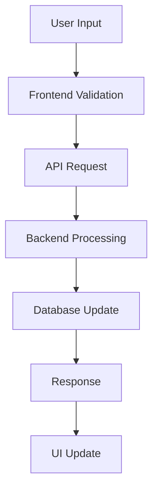

# 🏗️ Coordenação de Arquitetura

Para features ou mudanças que impactam múltiplos componentes, use este framework de coordenação:

## 🎯 Análise Arquitetural

### 1. Componentes Impactados

- **Frontend** (/apps/web): Quais páginas, componentes, rotas?
- **Backend** (/apps/api): Quais endpoints, serviços, modelos?
- **Shared** (/packages): Quais tipos, utilitários, componentes?

### 2. Fluxo de Dados

### 3. Integração entre Helpers

#### 🎨 Frontend Tasks → frontend-helper

- [ ] Componentes UI necessários
- [ ] Páginas e rotas
- [ ] Validação de formulários
- [ ] Integração com APIs
- [ ] Testes E2E

#### ⚙️ Backend Tasks → backend-helper

- [ ] Endpoints da API
- [ ] Modelos de dados
- [ ] Business logic
- [ ] Validação server-side
- [ ] Testes unitários

#### 📚 Documentation Tasks → documentation-helper

- [ ] API documentation (OpenAPI)
- [ ] Component documentation
- [ ] Architecture diagrams
- [ ] User guides

## 🔄 Sequência de Implementação

1. **Arquitetura** (dev-helper): Definir estrutura e contratos
2. **Backend** (backend-helper): Implementar APIs e lógica
3. **Frontend** (frontend-helper): Implementar UI e integração
4. **Documentation** (documentation-helper): Documentar solução
5. **Integration** (dev-helper): Coordenar testes e deploy

## 📊 Critérios de Qualidade

- **Performance**: Métricas esperadas
- **Security**: Validações e autorizações
- **Testing**: Coverage mínima por componente
- **Documentation**: Completude da documentação
- **Maintainability**: Padrões de código seguidos

Defina a arquitetura e coordene a implementação entre os helpers.
