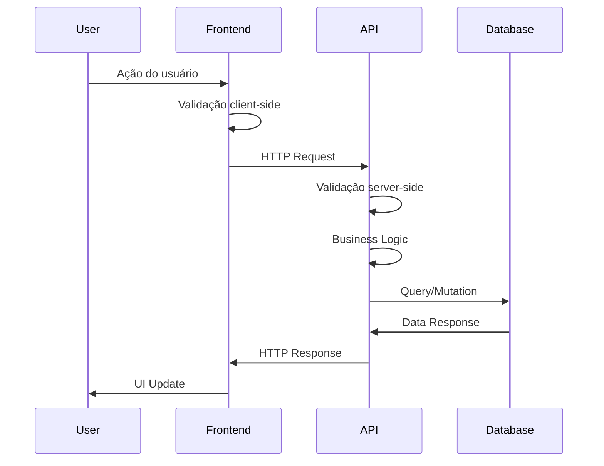
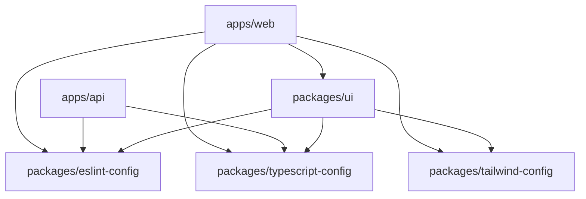
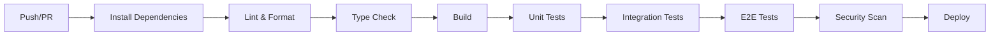

# 🏗️ Arquitetura do Template Monorepo

Este documento descreve a arquitetura completa do template, incluindo estrutura de pastas,
tecnologias utilizadas e padrões de design.

## 🎯 Visão Geral Arquitetural

### Princípios de Design

- **Monorepo**: Código unificado com packages independentes
- **Modularidade**: Separação clara entre frontend, backend e utilitários
- **Escalabilidade**: Arquitetura preparada para crescimento
- **Qualidade**: Automação de testes, lint e CI/CD
- **Developer Experience**: Ferramentas e helpers para produtividade

### Stack Tecnológica

```mermaid
graph TB
    subgraph "Frontend Stack"
        A[Next.js 15] --> B[React 18]
        B --> C[TypeScript 5]
        C --> D[Tailwind CSS]
        D --> E[React Hook Form]
        E --> F[Zod Validation]
    end

    subgraph "Backend Stack"
        G[NestJS 10] --> H[Node.js 20]
        H --> I[TypeScript 5]
        I --> J[PostgreSQL]
        J --> K[TypeORM/Prisma]
        K --> L[Redis Cache]
    end

    subgraph "DevOps Stack"
        M[Turborepo] --> N[pnpm]
        N --> O[GitHub Actions]
        O --> P[Jest Testing]
        P --> Q[ESLint/Prettier]
    end
```



## 📁 Estrutura de Pastas

### Root Level

```
template/
├── apps/                    # Aplicações principais
│   ├── web/                # Frontend Next.js
│   └── api/                # Backend NestJS
├── packages/               # Packages compartilhados
│   ├── ui/                 # Componentes React
│   ├── eslint-config/      # Configurações ESLint
│   ├── typescript-config/  # Configurações TypeScript
│   └── tailwind-config/    # Configurações Tailwind
├── .github/                # GitHub workflows e configurações
├── scripts/                # Scripts de automação
├── docs/                   # Documentação Nextra
└── .vscode/                # Configurações VS Code
```

### Apps Structure

#### Frontend (`apps/web/`)

```
web/
├── app/                    # Next.js App Router
│   ├── (routes)/          # Rotas agrupadas
│   ├── api/               # API routes
│   ├── globals.css        # Estilos globais
│   ├── layout.tsx         # Layout principal
│   └── page.tsx           # Homepage
├── components/            # Componentes específicos
├── lib/                   # Utilitários
├── public/                # Assets estáticos
├── __tests__/             # Testes
└── docs/                  # Documentação específica
```

#### Backend (`apps/api/`)

```
api/
├── src/
│   ├── modules/           # Módulos de negócio
│   │   ├── auth/         # Autenticação
│   │   ├── users/        # Usuários
│   │   └── health/       # Health check
│   ├── common/           # Código compartilhado
│   │   ├── decorators/   # Custom decorators
│   │   ├── filters/      # Exception filters
│   │   ├── guards/       # Auth guards
│   │   ├── interceptors/ # Interceptors
│   │   └── pipes/        # Validation pipes
│   ├── config/           # Configurações
│   ├── database/         # Database setup
│   ├── app.module.ts     # Módulo principal
│   └── main.ts           # Entry point
├── test/                 # Testes E2E
└── docs/                 # Documentação específica
```

### Packages Structure

#### UI Components (`packages/ui/`)

```
ui/
├── src/
│   ├── components/       # Componentes React
│   │   ├── button/      # Componente Button
│   │   ├── input/       # Componente Input
│   │   └── index.ts     # Exports
│   ├── hooks/           # Custom hooks
│   ├── utils/           # Utilitários
│   └── index.ts         # Entry point
├── __tests__/           # Testes
└── package.json         # Configuração
```

## 🔄 Fluxo de Dados

### Frontend → Backend



### Monorepo Dependencies



## 🛡️ Segurança

### Frontend Security

- **CSP Headers**: Content Security Policy
- **XSS Protection**: Sanitização de inputs
- **CSRF Protection**: Tokens anti-CSRF
- **HTTPS Enforcement**: Redirect automático
- **Bundle Analysis**: Análise de dependências

### Backend Security

- **Authentication**: JWT + Refresh Tokens
- **Authorization**: RBAC (Role-Based Access Control)
- **Input Validation**: class-validator + DTOs
- **Rate Limiting**: Proteção contra DDoS
- **CORS Configuration**: Origens permitidas
- **Helmet**: Security headers
- **SQL Injection**: ORM com prepared statements

### Infrastructure Security

- **Environment Variables**: Secrets management
- **Database Encryption**: Dados sensíveis criptografados
- **API Versioning**: Backward compatibility
- **Audit Logging**: Logs de auditoria
- **Dependency Scanning**: Vulnerabilidades automáticas

## ⚡ Performance

### Frontend Optimization

- **Code Splitting**: Lazy loading automático
- **Image Optimization**: Next.js Image component
- **Bundle Analysis**: webpack-bundle-analyzer
- **Core Web Vitals**: LCP, FID, CLS monitoring
- **Caching Strategy**: Static + Dynamic caching
- **Service Worker**: PWA capabilities

### Backend Optimization

- **Database Indexing**: Queries otimizadas
- **Redis Caching**: Cache distribuído
- **Connection Pooling**: Pool de conexões DB
- **Compression**: Gzip response compression
- **Query Optimization**: N+1 prevention
- **Memory Management**: Garbage collection tuning

### Build Optimization

- **Turborepo Caching**: Cache inteligente
- **Parallel Execution**: Builds paralelos
- **Incremental Builds**: Apenas mudanças
- **Tree Shaking**: Dead code elimination
- **Minification**: CSS + JS minification

## 🧪 Arquitetura de Testes

### Testing Pyramid

```mermaid
pyramid
    title Testing Strategy
    pyramid_levels:
        - level1: "E2E Tests (Playwright)"
        - level2: "Integration Tests (Supertest)"
        - level3: "Unit Tests (Jest + RTL)"
```

### Frontend Testing

- **Unit**: React Testing Library
- **Integration**: Component integration
- **E2E**: Playwright
- **Visual**: Storybook (opcional)
- **Performance**: Lighthouse CI

### Backend Testing

- **Unit**: Jest
- **Integration**: Supertest
- **Database**: Test database
- **API**: OpenAPI testing
- **Load**: Artillery (opcional)

## 🔄 CI/CD Architecture

### Pipeline Stages



### Environment Strategy

- **Development**: Local development
- **Staging**: PR previews
- **Production**: Main branch deploy
- **Feature**: Feature branch previews

## 🤖 AI Integration Architecture

### Copilot Helpers System

```mermaid
graph TD
    A[User Request] --> B{Issue Type}
    B -->|Complex| C[@dev-helper]
    B -->|Frontend| D[@frontend-helper]
    B -->|Backend| E[@backend-helper]
    B -->|Docs| F[@documentation-helper]

    C --> G[Analyze & Distribute]
    G --> D
    G --> E
    G --> F

    D --> H[Implementation]
    E --> H
    F --> I[Documentation]
    H --> I
```

### AI Decision Matrix

- **Complexity Analysis**: 1-5 scale
- **Impact Assessment**: 1-5 scale
- **Urgency Evaluation**: 1-5 scale
- **Automatic Routing**: Helper selection
- **Quality Assurance**: Code review

## 📊 Monitoring & Observability

### Application Monitoring

- **Error Tracking**: Error boundaries + logging
- **Performance Metrics**: Core Web Vitals
- **User Analytics**: Privacy-first analytics
- **API Monitoring**: Response times + errors
- **Database Monitoring**: Query performance

### Infrastructure Monitoring

- **Health Checks**: Automated health endpoints
- **Resource Usage**: CPU, Memory, Disk
- **Network Monitoring**: Latency, throughput
- **Log Aggregation**: Structured logging
- **Alerting**: Automated incident response

## 🔮 Extensibilidade

### Adding New Apps

1. Create new app in `apps/`
2. Configure `turbo.json`
3. Add to CI/CD pipeline
4. Update documentation

### Adding New Packages

1. Create package in `packages/`
2. Define dependencies
3. Add tests
4. Export types

### Scaling Considerations

- **Database Sharding**: Horizontal scaling
- **Microservices**: Service extraction
- **CDN Integration**: Global distribution
- **Load Balancing**: Multiple instances
- **Caching Layers**: Multi-level caching

Esta arquitetura fornece uma base sólida e escalável para desenvolvimento fullstack moderno, com
foco em qualidade, performance e developer experience.
