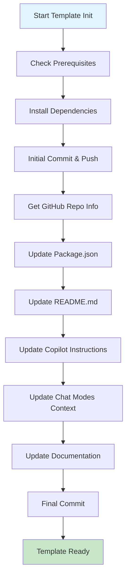

# 🚀 Scripts de Inicialização do Template

Este documento explica o sistema de inicialização automática que configura o template com as
informações do repositório atual.

## 🎯 Visão Geral

O sistema de inicialização automatiza:

1. **Instalação de dependências** com pnpm
2. **Commit inicial** com mensagem padronizada
3. **Push para repositório** remoto
4. **Coleta de metadados** do repositório GitHub
5. **Atualização de arquivos** com informações do projeto
6. **Contextualização dos helpers** de IA

## 📋 Scripts Disponíveis

### 1. Script Principal (`scripts/init-template.js`)

**Função**: Script principal em Node.js que coordena toda a inicialização.

```javascript
// Fluxo de execução
1. Verificação de ambiente
2. Instalação de dependências
3. Commit e push inicial
4. Coleta de metadados GitHub
5. Atualização de arquivos
6. Contextualização de IA helpers
7. Commit final das mudanças
```

**Uso**:

```bash
# Via package.json
pnpm template:init

# Direto
node scripts/init-template.js
```

### 2. Script Unix (`scripts/init-template.sh`)

**Função**: Versão bash para sistemas Unix/Linux/macOS.

```bash
#!/bin/bash
# Executáveis necessários: git, node, pnpm, gh (GitHub CLI)
```

**Uso**:

```bash
chmod +x scripts/init-template.sh
./scripts/init-template.sh
```

### 3. Script Windows (`scripts/init-template.bat`)

**Função**: Versão batch para Windows.

```batch
@echo off
REM Executáveis necessários: git, node, pnpm, gh
```

**Uso**:

```cmd
scripts\init-template.bat
```

## 🔧 Funcionalidades Detalhadas

### 1. Verificação de Pré-requisitos

```javascript
// Verifica se as ferramentas necessárias estão instaladas
const prerequisites = [
  'git', // Controle de versão
  'node', // JavaScript runtime
  'pnpm', // Package manager
  'gh', // GitHub CLI (opcional)
]
```

### 2. Instalação de Dependências

```bash
# Instala todas as dependências do monorepo
pnpm install

# Benefícios:
# - Cache otimizado do pnpm
# - Hoisting inteligente
# - Workspace linking automático
```

### 3. Commit e Push Inicial

```bash
# Amend do commit inicial para manter histórico limpo
git commit --amend -m "chore(main): initialize project structure"

# Push com force para sobrescrever template commit
git push --force origin main
```

### 4. Coleta de Metadados GitHub

```javascript
// Via GitHub CLI ou API
const repoInfo = {
  name: 'project-name',
  description: 'Project description from GitHub',
  owner: 'username',
  url: 'https://github.com/username/project-name',
  topics: ['nextjs', 'nestjs', 'typescript'],
  visibility: 'public/private',
}
```

### 5. Atualização Automática de Arquivos

#### Package.json

```json
{
  "name": "{{REPO_NAME}}",
  "description": "{{REPO_DESCRIPTION}}",
  "homepage": "{{REPO_URL}}",
  "repository": {
    "type": "git",
    "url": "{{REPO_URL}}.git"
  }
}
```

#### README.md

```markdown
# {{REPO_NAME}}

{{REPO_DESCRIPTION}}

## About this project

{{DETAILED_DESCRIPTION}}
```

#### Copilot Instructions

```markdown
## Project Context

- **Name**: {{REPO_NAME}}
- **Description**: {{REPO_DESCRIPTION}}
- **Domain**: {{PROJECT_DOMAIN}}
- **Tech Stack**: {{TECH_STACK}}
```

### 6. Contextualização de IA Helpers

```javascript
// Atualiza instruções dos helpers com contexto do projeto
const projectContext = `
This project is: ${repoDescription}
Domain: ${inferDomain(repoDescription)}
Key features: ${extractFeatures(repoDescription)}
Target audience: ${inferAudience(repoDescription)}
`

// Aplica em todos os chat modes
updateChatModes(projectContext)
```

## 📊 Fluxo de Execução Completo



## 🎯 Arquivos Atualizados

### Configuração Base

- `package.json` - Nome, descrição, repositório
- `README.md` - Documentação principal
- `apps/web/package.json` - Frontend package
- `apps/api/package.json` - Backend package

### Documentação

- `.github/wiki/HOME.md` - Wiki principal
- `docs/index.mdx` - Documentação Nextra
- `TEMPLATE_USAGE.md` - Guia de uso

### IA Context

- `.github/instructions/copilot.instructions.md`
- `.github/chatmodes/*.chatmode.md`
- `.vscode/copilot-profiles.json`

## 🛠️ Configuração Avançada

### Variáveis de Ambiente

```bash
# Opcionais para customização
GITHUB_TOKEN=ghp_xxxx           # Para API calls autenticadas
PROJECT_DOMAIN=ecommerce        # Força domínio específico
SKIP_AI_UPDATE=true            # Pula atualização de IA
DRY_RUN=true                   # Execução teste
```

### Configuração Personalizada

```javascript
// scripts/config/init-config.js
module.exports = {
  skipDependencies: false, // Pular instalação
  skipGitOperations: false, // Pular git ops
  skipAIUpdate: false, // Pular IA update
  customCommitMessage: null, // Mensagem custom
  preserveTemplateFiles: false, // Manter arquivos template
}
```

## 🔍 Detecção Inteligente de Contexto

### Análise de Descrição

```javascript
const domainPatterns = {
  ecommerce: /shop|store|cart|product|payment|order/i,
  blog: /blog|article|post|content|cms/i,
  dashboard: /admin|dashboard|analytics|metrics/i,
  api: /api|service|microservice|backend/i,
  portfolio: /portfolio|personal|resume|cv/i,
}
```

### Extração de Features

```javascript
const featurePatterns = {
  auth: /auth|login|user|account/i,
  payment: /payment|stripe|paypal|checkout/i,
  realtime: /realtime|websocket|live|chat/i,
  mobile: /mobile|app|react native/i,
}
```

## 🚨 Tratamento de Erros

### Validações

- **Git repository**: Deve ser um repo git válido
- **Remote origin**: Deve ter remote configurado
- **GitHub access**: Acesso ao repositório via API
- **File permissions**: Permissões de escrita

### Recuperação

```javascript
// Rollback em caso de falha
const rollback = {
  git: 'git reset --hard HEAD~1',
  files: 'git checkout HEAD -- .',
  dependencies: 'rm -rf node_modules',
}
```

## 📋 Checklist de Validação

Após execução, verificar:

- [ ] `package.json` atualizado com nome correto
- [ ] `README.md` com descrição do projeto
- [ ] Dependencies instaladas (`node_modules/`)
- [ ] Git history limpo (1 commit inicial)
- [ ] Copilot helpers contextualizados
- [ ] Wiki atualizada com informações do projeto
- [ ] CI/CD pipeline funcional

## 🎯 Melhores Práticas

### Antes da Execução

1. **Configure o repositório** no GitHub primeiro
2. **Adicione descrição detalhada** no GitHub
3. **Configure topics/tags** relevantes
4. **Verifique permissões** de acesso

### Durante a Execução

1. **Execute em ambiente limpo** (fresh clone)
2. **Aguarde conclusão completa** (não interrompa)
3. **Monitore logs** para possíveis erros
4. **Valide resultados** após conclusão

### Após a Execução

1. **Teste build completo** (`pnpm build`)
2. **Execute testes** (`pnpm test`)
3. **Valide helpers IA** com `@dev-helper`
4. **Documente customizações** específicas

Este sistema garante que cada projeto criado a partir do template seja automaticamente configurado
com as informações corretas e contexto apropriado para desenvolvimento eficiente.
